ORCHESTRATING CONTAINERS ACROSS MULTIPLE VIRTUAL SERVERS WITH KUBERNETES. PART 1

## Kubernetes From-Ground-Up

PLEASE NOTE: The following setup of Kubernetes used in this project is for learning purpose only, and not to be considered for production. This is because setting up a K8s cluster for production use has a lot more moving parts, especially when it comes to planning the nodes, and securing the cluster.


Tools to be used and expected result 
- VM: AWS EC2
- OS: Ubuntu 20.04 lts+
- Docker Engine
- kubectl console utility
- cfssl and cfssljson utilities
- Kubernetes cluster

3 EC2 Instances will be created, and in the end, the following parts of the cluster would have been configured properly:

One Kubernetes Master
Two Kubernetes Worker Nodes
Configured SSL/TLS certificates for Kubernetes components to communicate securely
Configured Node Network
Configured Pod Network

### STEP 0-INSTALL CLIENT TOOLS BEFORE BOOTSTRAPPING THE CLUSTER

First, we will need some client tools installed and configurations made on your client workstation:

- awscli – is a unified tool to manage your AWS services
- kubectl – this command line utility will be your main control tool to manage your K8s cluster. You will use this tool so many times, so you will be able to type ‘kubetcl’ on your keyboard with a speed of light. You can always make a shortcut (alias) to just one character ‘k’. Also, add this extremely useful official kubectl Cheat Sheet to your bookmarks, it has examples of the most used ‘kubectl’ commands.
- cfssl – an open source toolkit for everything TLS/SSL from Cloudflare
- cfssljson – a program, which takes the JSON output from the cfssl and writes certificates, keys, CSRs, and bundles to disk.

Installed and configured AWS CLI

- Downloaded the AWS CLI using this link https://aws.amazon.com/cli/

- Configured the AWS CLI and confirmed that it is running 

```
aws configure --profile %your_username%
AWS Access Key ID [None]: 
AWS Secret Access Key [None]: 
Default region name [None]: 
Default output format [None]: json
```

```
aws ec2 describe-vpcs
```


Installed kubectl

With this tool we can easily interact with Kubernetes to deploy applications, inspect and manage cluster resources, view logs and perform many more administrative operations.

For MAC OS 

- Downloaded the binary

```
curl -o kubectl https://storage.googleapis.com/kubernetes-release/release/v1.21.0/bin/darwin/amd64/kubectl
```

- Made it executable with the command below
```
chmod +x kubectl
```

- Then moved it to the bin  directory

```
Move to the Bin directory
```

Installed CFSSL and CFSSLJSON

cfssl is an open source tool by Cloudflare used to setup a Public Key Infrastructure (PKI Infrastructure) for generating, signing and bundling TLS certificates. cfssl will be configured as a Certificate Authority which will issue the certificates required to spin up a Kubernetes cluster.

- Installed CFSSL and CFSSLJSON for mac

```
curl -o cfssl https://storage.googleapis.com/kubernetes-the-hard-way/cfssl/1.4.1/darwin/cfssl
curl -o cfssljson https://storage.googleapis.com/kubernetes-the-hard-way/cfssl/1.4.1/darwin/cfssljson
```

```
chmod +x cfssl cfssljson
```

```
sudo mv cfssl cfssljson /usr/local/bin/
```

- verified the installation  

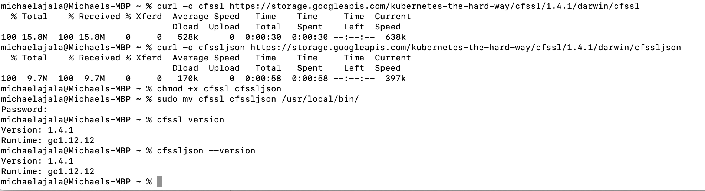

### Step 1 – Configure Network Infrastructure

- Created a directory and named it  k8s-cluster-from-ground-up

VPC

- Created a VPC and stored the ID as a variable with the command below:

```
VPC_ID=$(aws ec2 create-vpc \
--cidr-block 172.31.0.0/16 \
--output text --query 'Vpc.VpcId'
)
```

- Tagged the VPC 

```
NAME=k8s-cluster-from-ground-up

aws ec2 create-tags \
  --resources ${VPC_ID} \
  --tags Key=Name,Value=${NAME}
```

- Enabled DNS support for the VPC:

```
aws ec2 modify-vpc-attribute \
--vpc-id ${VPC_ID} \
--enable-dns-support '{"Value": true}'
```

- Enabled DNS support for hostnames:

```
aws ec2 modify-vpc-attribute \
--vpc-id ${VPC_ID} \
--enable-dns-hostnames '{"Value": true}'
```

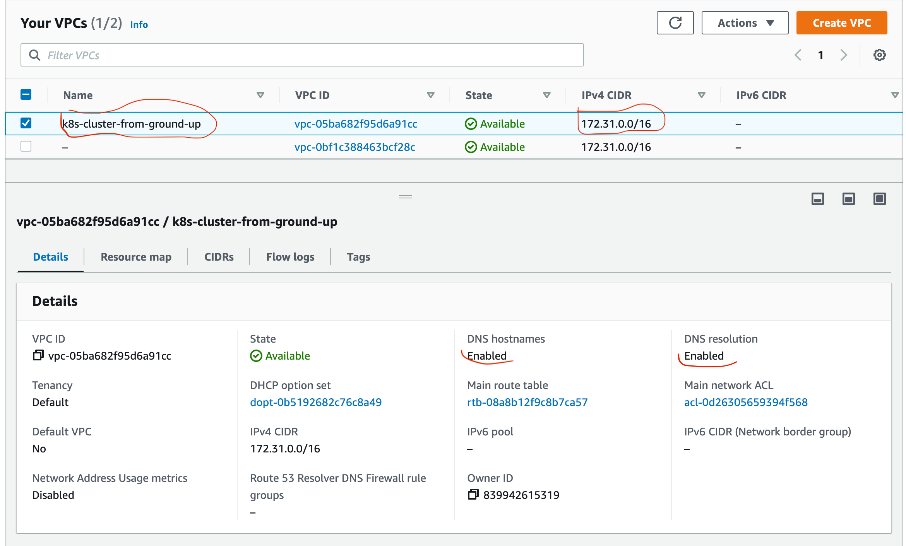

DHCP

- Configured DHCP Options Set:

```
DHCP_OPTION_SET_ID=$(aws ec2 create-dhcp-options \
  --dhcp-configuration \
    "Key=domain-name,Values=$AWS_REGION.compute.internal" \
    "Key=domain-name-servers,Values=AmazonProvidedDNS" \
  --output text --query 'DhcpOptions.DhcpOptionsId')
```

- Tagged the DHCP Option set:

```
aws ec2 create-tags \
  --resources ${DHCP_OPTION_SET_ID} \
  --tags Key=Name,Value=${NAME}
```

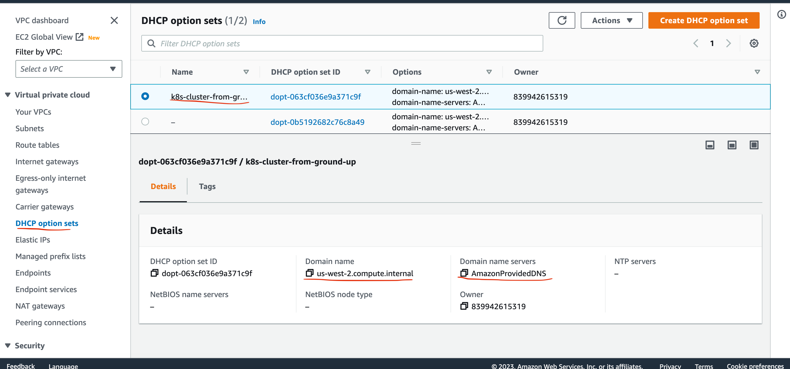

- Associated the DHCP Option set with the VPC:

```
aws ec2 associate-dhcp-options \
  --dhcp-options-id ${DHCP_OPTION_SET_ID} \
  --vpc-id ${VPC_ID}
```

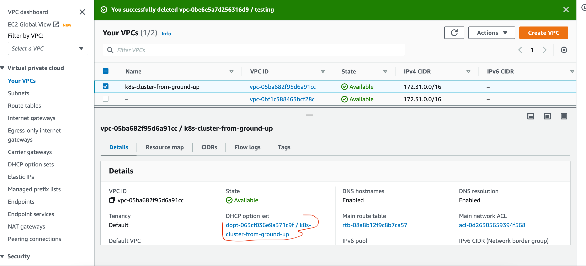

SUBNET

- Created a Subnet:

```
SUBNET_ID=$(aws ec2 create-subnet \
  --vpc-id ${VPC_ID} \
  --cidr-block 172.31.0.0/24 \
  --output text --query 'Subnet.SubnetId')
```

```
aws ec2 create-tags \
  --resources ${SUBNET_ID} \
  --tags Key=Name,Value=${NAME}
```

INTERNET GATEWAY

- Created Internet Gateway – IGW and attached it to the VPC 

```
INTERNET_GATEWAY_ID=$(aws ec2 create-internet-gateway \
  --output text --query 'InternetGateway.InternetGatewayId')
aws ec2 create-tags \
  --resources ${INTERNET_GATEWAY_ID} \
  --tags Key=Name,Value=${NAME}
```

```
aws ec2 attach-internet-gateway \
  --internet-gateway-id ${INTERNET_GATEWAY_ID} \
  --vpc-id ${VPC_ID}
```
ROUTE TABLES

- Created route tables, associated the route table to subnet, and created a route to allow external traffic to the Internet through the Internet Gateway:

```
ROUTE_TABLE_ID=$(aws ec2 create-route-table \
  --vpc-id ${VPC_ID} \
  --output text --query 'RouteTable.RouteTableId')
aws ec2 create-tags \
  --resources ${ROUTE_TABLE_ID} \
  --tags Key=Name,Value=${NAME}
aws ec2 associate-route-table \
  --route-table-id ${ROUTE_TABLE_ID} \
  --subnet-id ${SUBNET_ID}
aws ec2 create-route \
  --route-table-id ${ROUTE_TABLE_ID} \
  --destination-cidr-block 0.0.0.0/0 \
  --gateway-id ${INTERNET_GATEWAY_ID}
```

 After running the command above, the output can bee seen below:


SECURITY GROUPS CONFIGURATION 

- Created the security group and stored its ID in a variable:

```
SECURITY_GROUP_ID=$(aws ec2 create-security-group \
  --group-name ${NAME} \
  --description "Kubernetes cluster security group" \
  --vpc-id ${VPC_ID} \
  --output text --query 'GroupId')
```

- Created the NAME tag for the security group

```
aws ec2 create-tags \
  --resources ${SECURITY_GROUP_ID} \
  --tags Key=Name,Value=${NAME}
```

- Created Inbound traffic for all communication within the subnet to connect on ports used by the master node(s):

```
aws ec2 authorize-security-group-ingress \
    --group-id ${SECURITY_GROUP_ID} \
    --ip-permissions IpProtocol=tcp,FromPort=2379,ToPort=2380,IpRanges='[{CidrIp=172.31.0.0/24}]'
```

- Created Inbound traffic for all communication within the subnet to connect on ports used by the worker nodes

```
aws ec2 authorize-security-group-ingress \
    --group-id ${SECURITY_GROUP_ID} \
    --ip-permissions IpProtocol=tcp,FromPort=30000,ToPort=32767,IpRanges='[{CidrIp=172.31.0.0/24}]'
```

- Created inbound traffic to allow connections to the Kubernetes API Server listening on port 6443

```
aws ec2 authorize-security-group-ingress \
  --group-id ${SECURITY_GROUP_ID} \
  --protocol tcp \
  --port 6443 \
  --cidr 0.0.0.0/0
```

- Created Inbound traffic for SSH from anywhere (Do not do this in production. Limit access ONLY to IPs or CIDR that MUST connect):

```
aws ec2 authorize-security-group-ingress \
  --group-id ${SECURITY_GROUP_ID} \
  --protocol tcp \
  --port 22 \
  --cidr 0.0.0.0/0
```

-  Created ICMP ingress for all types

```
aws ec2 authorize-security-group-ingress \
  --group-id ${SECURITY_GROUP_ID} \
  --protocol icmp \
  --port -1 \
  --cidr 0.0.0.0/0
```

NETWORK LOAD BALANCER

- Created a network Load balancer:

```
LOAD_BALANCER_ARN=$(aws elbv2 create-load-balancer \
--name ${NAME} \
--subnets ${SUBNET_ID} \
--scheme internet-facing \
--type network \
--output text --query 'LoadBalancers[].LoadBalancerArn')
```

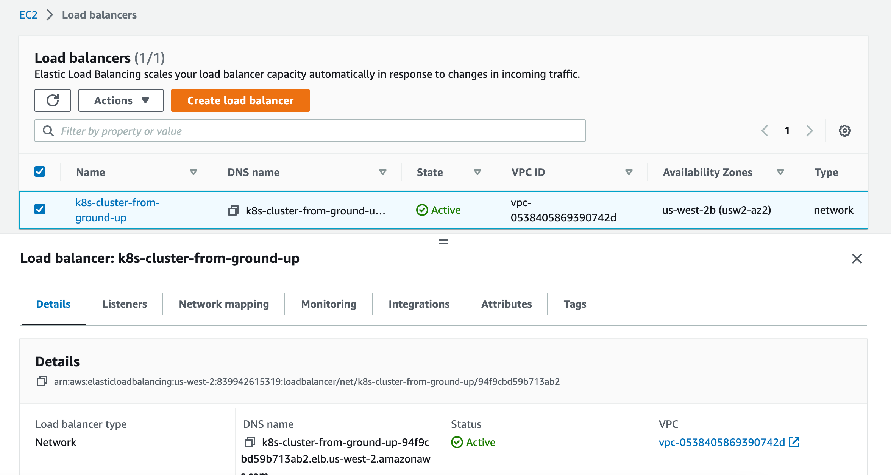

TARGET GROUP

- Created a target group: (For now it will be unhealthy because there are no real targets yet.)

```
TARGET_GROUP_ARN=$(aws elbv2 create-target-group \
  --name ${NAME} \
  --protocol TCP \
  --port 6443 \
  --vpc-id ${VPC_ID} \
  --target-type ip \
  --output text --query 'TargetGroups[].TargetGroupArn')
```

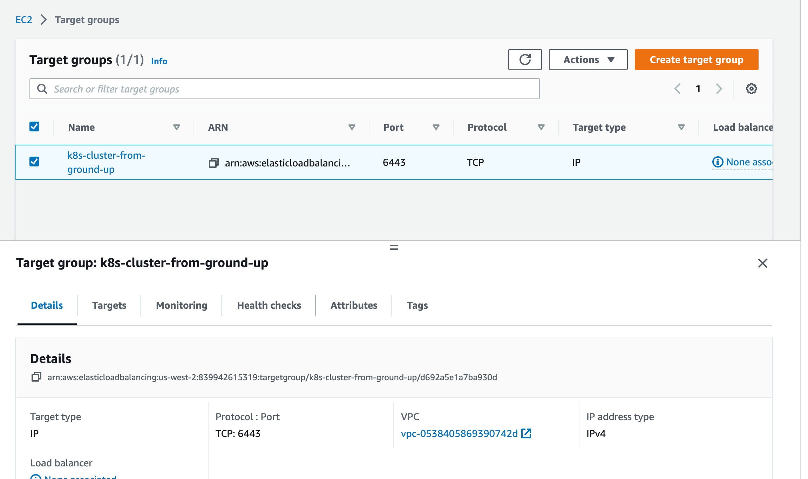

- Register targets: (as seen in the image above, there are no real targets. therefore we will just put the IP addresses, so that when the nodes become available, they will be used as targets.)

```
aws elbv2 register-targets \
  --target-group-arn ${TARGET_GROUP_ARN} \
  --targets Id=172.31.0.1{0,1,2}
```

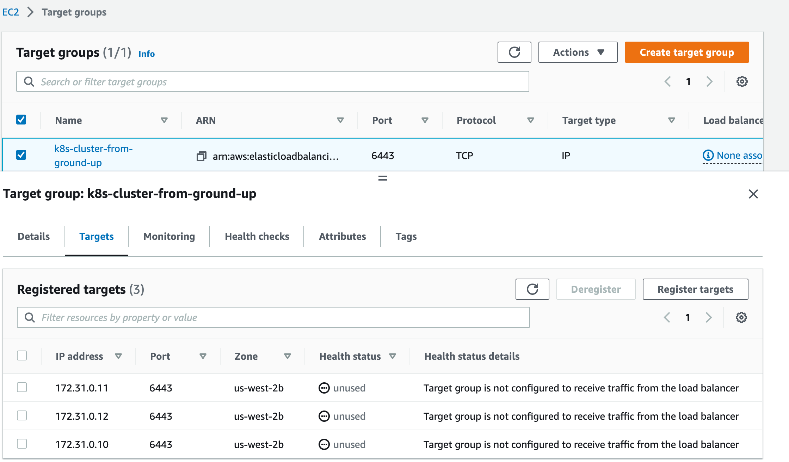

- Created a listener to listen for requests and forward to the target nodes on TCP port 6443:

```
aws elbv2 create-listener \
--load-balancer-arn ${LOAD_BALANCER_ARN} \
--protocol TCP \
--port 6443 \
--default-actions Type=forward,TargetGroupArn=${TARGET_GROUP_ARN} \
--output text --query 'Listeners[].ListenerArn'
```

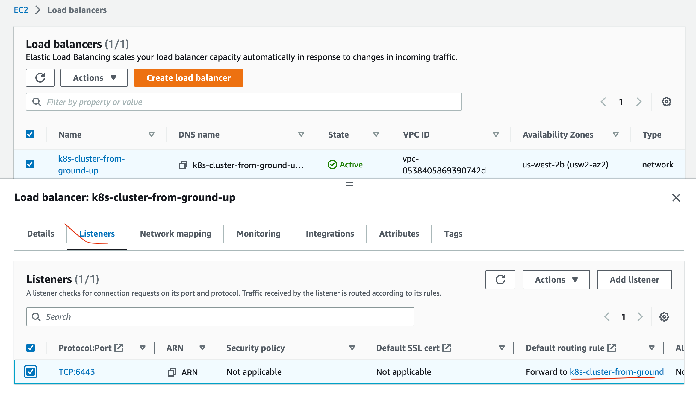

K8s PUBLIC ADDRESS

- Got the Kubernetes Public address:

```
KUBERNETES_PUBLIC_ADDRESS=$(aws elbv2 describe-load-balancers \
--load-balancer-arns ${LOAD_BALANCER_ARN} \
--output text --query 'LoadBalancers[].DNSName')
```

### Step 2 – Create Compute Resources

AMI

- Get an image to create EC2 instances:

The code below requires jq. "jq" is a lightweight and flexible command-line JSON processor that allows you to manipulate and extract data from JSON files

installed it with
```
brew install jq
```

```
IMAGE_ID=$(aws ec2 describe-images --owners 099720109477 \
  --filters \
  'Name=root-device-type,Values=ebs' \
  'Name=architecture,Values=x86_64' \
  'Name=name,Values=ubuntu/images/hvm-ssd/ubuntu-xenial-16.04-amd64-server-*' \
  | jq -r '.Images|sort_by(.Name)[-1]|.ImageId')
```

SSH KEY-PAIR

- Created SSH key-Pair

```
mkdir -p ssh

aws ec2 create-key-pair \
  --key-name ${NAME} \
  --output text --query 'KeyMaterial' \
  > ssh/${NAME}.id_rsa
chmod 600 ssh/${NAME}.id_rsa
```


EC2 INSTANCES FOR CONTROLE PLANE (MASTER NODES)

- CreateD 3 Master nodes:

```
for i in 0 1 2; do
  instance_id=$(aws ec2 run-instances \
    --associate-public-ip-address \
    --image-id ${IMAGE_ID} \
    --count 1 \
    --key-name ${NAME} \
    --security-group-ids ${SECURITY_GROUP_ID} \
    --instance-type t2.micro \
    --private-ip-address 172.31.0.1${i} \
    --user-data "name=master-${i}" \
    --subnet-id ${SUBNET_ID} \
    --output text --query 'Instances[].InstanceId')
  aws ec2 modify-instance-attribute \
    --instance-id ${instance_id} \
    --no-source-dest-check
  aws ec2 create-tags \
    --resources ${instance_id} \
    --tags "Key=Name,Value=${NAME}-master-${i}"
done
```

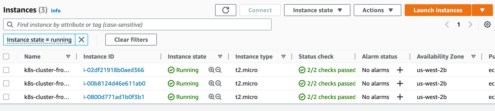


EC2 INSTANCES FOR WORKER NODES

- Created 3 worker nodes:

```
for i in 0 1 2; do
  instance_id=$(aws ec2 run-instances \
    --associate-public-ip-address \
    --image-id ${IMAGE_ID} \
    --count 1 \
    --key-name ${NAME} \
    --security-group-ids ${SECURITY_GROUP_ID} \
    --instance-type t2.micro \
    --private-ip-address 172.31.0.2${i} \
    --user-data "name=worker-${i}|pod-cidr=172.20.${i}.0/24" \
    --subnet-id ${SUBNET_ID} \
    --output text --query 'Instances[].InstanceId')
  aws ec2 modify-instance-attribute \
    --instance-id ${instance_id} \
    --no-source-dest-check
  aws ec2 create-tags \
    --resources ${instance_id} \
    --tags "Key=Name,Value=${NAME}-worker-${i}"
done
```

### Step 3 Prepare The Self-Signed Certificate Authority And Generate TLS Certificates

Note The following components running on the Master node will require TLS certificates.

- kube-controller-manager
- kube-scheduler
- etcd
- kube-apiserver

The following components running on the Worker nodes will require TLS certificates.

- kubelet
- kube-proxy

Therefore, we will provision a PKI Infrastructure using cfssl which will have a Certificate Authority. The CA will then generate certificates for all the individual components.


SELF-SIGNED ROOT CERTIFICATE AUTHORITY (CA)

Here, a CA will be provisioned which will be used to sign additional TLS certificates.

- Created a directory and cd into it:

```
mkdir ca-authority && cd ca-authority
```

Generate the CA configuration file, Root Certificate, and Private key:

```
{

cat > ca-config.json <<EOF
{
  "signing": {
    "default": {
      "expiry": "8760h"
    },
    "profiles": {
      "kubernetes": {
        "usages": ["signing", "key encipherment", "server auth", "client auth"],
        "expiry": "8760h"
      }
    }
  }
}
EOF

cat > ca-csr.json <<EOF
{
  "CN": "Kubernetes",
  "key": {
    "algo": "rsa",
    "size": 2048
  },
  "names": [
    {
      "C": "UK",
      "L": "England",
      "O": "Kubernetes",
      "OU": "DAREY.IO DEVOPS",
      "ST": "London"
    }
  ]
}
EOF

cfssl gencert -initca ca-csr.json | cfssljson -bare ca

}
```

The output is seen below

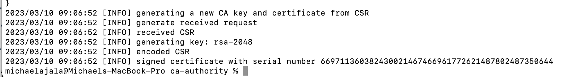


The file defines the following:

```
CN – Common name for the authority

algo – the algorithm used for the certificates

size – algorithm size in bits

C – Country

L – Locality (city)

ST – State or province

O – Organization

OU – Organizational Unit
```

- Listed the directory to see the created files

```
ls -ltr
```

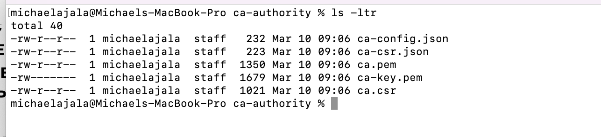

Note the 3 important files here are:

- ca.pem – The Root Certificate
- ca-key.pem – The Private Key
- ca.csr – The Certificate Signing Request

GENERATING TLS CERTIFICATE FOR CLIENT AND SERVER

There is a need to provision Client/Server certificates for all the components. It is a MUST to have encrypted communication within the cluster. Therefore, the server here are the master nodes running the api-server component. While the client is every other component that needs to communicate with the api-server.

Now we have a certificate for the Root CA, we can then begin to request more certificates which the different Kubernetes components, i.e. clients and server, will use to have encrypted communication.

Note that the clients here refer to every other component that will communicate with the api-server. which include:

- kube-controller-manager
- kube-scheduler
- etcd
- kubelet
- kube-proxy
- Kubernetes Admin User

started with

KUBERNETES API-SERVER CERTIFICATE AND PRIVATE KEY

The certificate for the Api-server must have IP addresses, DNS names, and a Load Balancer address included. Otherwise, there will have a lot of difficulties connecting to the api-server.

- Generated the Certificate Signing Request (CSR), Private Key and the Certificate for the Kubernetes Master Nodes.

```
{
cat > master-kubernetes-csr.json <<EOF
{
  "CN": "kubernetes",
   "hosts": [
   "127.0.0.1",
   "172.31.0.10",
   "172.31.0.11",
   "172.31.0.12",
   "ip-172-31-0-10",
   "ip-172-31-0-11",
   "ip-172-31-0-12",
   "ip-172-31-0-10.${AWS_REGION}.compute.internal",
   "ip-172-31-0-11.${AWS_REGION}.compute.internal",
   "ip-172-31-0-12.${AWS_REGION}.compute.internal",
   "${KUBERNETES_PUBLIC_ADDRESS}",
   "kubernetes",
   "kubernetes.default",
   "kubernetes.default.svc",
   "kubernetes.default.svc.cluster",
   "kubernetes.default.svc.cluster.local"
  ],
  "key": {
    "algo": "rsa",
    "size": 2048
  },
  "names": [
    {
      "C": "UK",
      "L": "England",
      "O": "Kubernetes",
      "OU": "DAREY.IO DEVOPS",
      "ST": "London"
    }
  ]
}
EOF

cfssl gencert \
  -ca=ca.pem \
  -ca-key=ca-key.pem \
  -config=ca-config.json \
  -profile=kubernetes \
  master-kubernetes-csr.json | cfssljson -bare master-kubernetes
}
```

- kube-scheduler Client Certificate and Private Key

```
{

cat > kube-scheduler-csr.json <<EOF
{
  "CN": "system:kube-scheduler",
  "key": {
    "algo": "rsa",
    "size": 2048
  },
  "names": [
    {
      "C": "UK",
      "L": "England",
      "O": "system:kube-scheduler",
      "OU": "DAREY.IO DEVOPS",
      "ST": "London"
    }
  ]
}
EOF

cfssl gencert \
  -ca=ca.pem \
  -ca-key=ca-key.pem \
  -config=ca-config.json \
  -profile=kubernetes \
  kube-scheduler-csr.json | cfssljson -bare kube-scheduler

}
```

- kube-proxy Client Certificate and Private Key

```
{

cat > kube-proxy-csr.json <<EOF
{
  "CN": "system:kube-proxy",
  "key": {
    "algo": "rsa",
    "size": 2048
  },
  "names": [
    {
      "C": "UK",
      "L": "England",
      "O": "system:node-proxier",
      "OU": "DAREY.IO DEVOPS",
      "ST": "London"
    }
  ]
}
EOF

cfssl gencert \
  -ca=ca.pem \
  -ca-key=ca-key.pem \
  -config=ca-config.json \
  -profile=kubernetes \
  kube-proxy-csr.json | cfssljson -bare kube-proxy

}
```

- kube-controller-manager Client Certificate and Private Key

```
{
cat > kube-controller-manager-csr.json <<EOF
{
  "CN": "system:kube-controller-manager",
  "key": {
    "algo": "rsa",
    "size": 2048
  },
  "names": [
    {
      "C": "UK",
      "L": "England",
      "O": "system:kube-controller-manager",
      "OU": "DAREY.IO DEVOPS",
      "ST": "London"
    }
  ]
}
EOF

cfssl gencert \
  -ca=ca.pem \
  -ca-key=ca-key.pem \
  -config=ca-config.json \
  -profile=kubernetes \
  kube-controller-manager-csr.json | cfssljson -bare kube-controller-manager

}
```

- kubelet Client Certificate and Private Key

```
for i in 0 1 2; do
  instance="${NAME}-worker-${i}"
  instance_hostname="ip-172-31-0-2${i}"
  cat > ${instance}-csr.json <<EOF
{
  "CN": "system:node:${instance_hostname}",
  "key": {
    "algo": "rsa",
    "size": 2048
  },
  "names": [
    {
      "C": "UK",
      "L": "England",
      "O": "system:nodes",
      "OU": "DAREY.IO DEVOPS",
      "ST": "London"
    }
  ]
}
EOF

  external_ip=$(aws ec2 describe-instances \
    --filters "Name=tag:Name,Values=${instance}" \
    --output text --query 'Reservations[].Instances[].PublicIpAddress')

  internal_ip=$(aws ec2 describe-instances \
    --filters "Name=tag:Name,Values=${instance}" \
    --output text --query 'Reservations[].Instances[].PrivateIpAddress')

  cfssl gencert \
    -ca=ca.pem \
    -ca-key=ca-key.pem \
    -config=ca-config.json \
    -hostname=${instance_hostname},${external_ip},${internal_ip} \
    -profile=kubernetes \
    ${NAME}-worker-${i}-csr.json | cfssljson -bare ${NAME}-worker-${i}
done
```

- kubernetes admin user's Client Certificate and Private Key

```
{
cat > admin-csr.json <<EOF
{
  "CN": "admin",
  "key": {
    "algo": "rsa",
    "size": 2048
  },
  "names": [
    {
      "C": "UK",
      "L": "England",
      "O": "system:masters",
      "OU": "DAREY.IO DEVOPS",
      "ST": "London"
    }
  ]
}
EOF

cfssl gencert \
  -ca=ca.pem \
  -ca-key=ca-key.pem \
  -config=ca-config.json \
  -profile=kubernetes \
  admin-csr.json | cfssljson -bare admin
}
```

- Token Controller

```
{

cat > service-account-csr.json <<EOF
{
  "CN": "service-accounts",
  "key": {
    "algo": "rsa",
    "size": 2048
  },
  "names": [
    {
      "C": "UK",
      "L": "England",
      "O": "Kubernetes",
      "OU": "DAREY.IO DEVOPS",
      "ST": "London"
    }
  ]
}
EOF

cfssl gencert \
  -ca=ca.pem \
  -ca-key=ca-key.pem \
  -config=ca-config.json \
  -profile=kubernetes \
  service-account-csr.json | cfssljson -bare service-account
}
```

### STEP 4 - DISTRIBUTING THE CLIENT AND SERVER CERTIFICATES

Now it is time to start sending all the client and server certificates to their respective instances.

For the worker nodes:

Copied the files below securely to the worker nodes using scp utility.

- Root CA certificate – ca.pem
- X509 Certificate for each worker node
- Private Key of the certificate for each worker node

```
for i in 0 1 2; do
  instance="${NAME}-worker-${i}"
  external_ip=$(aws ec2 describe-instances \
    --filters "Name=tag:Name,Values=${instance}" \
    --output text --query 'Reservations[].Instances[].PublicIpAddress')
  scp -i ../ssh/${NAME}.id_rsa \
    ca.pem ${instance}-key.pem ${instance}.pem ubuntu@${external_ip}:~/; \
done
```
The Output can be seen below:

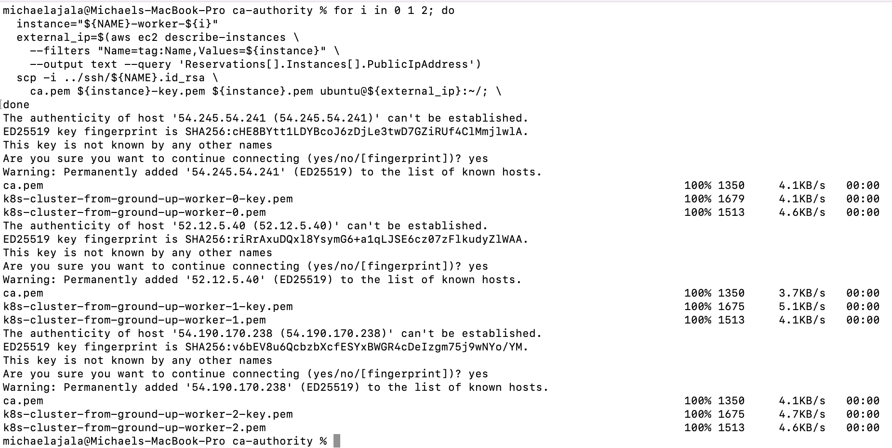

- for the Master or Controller node

Note that only the api-server related files will be sent over to the master nodes.

```
for i in 0 1 2; do
instance="${NAME}-master-${i}" \
  external_ip=$(aws ec2 describe-instances \
    --filters "Name=tag:Name,Values=${instance}" \
    --output text --query 'Reservations[].Instances[].PublicIpAddress')
  scp -i ../ssh/${NAME}.id_rsa \
    ca.pem ca-key.pem service-account-key.pem service-account.pem \
    master-kubernetes.pem master-kubernetes-key.pem ubuntu@${external_ip}:~/;
done
```
The Output can be seen below:

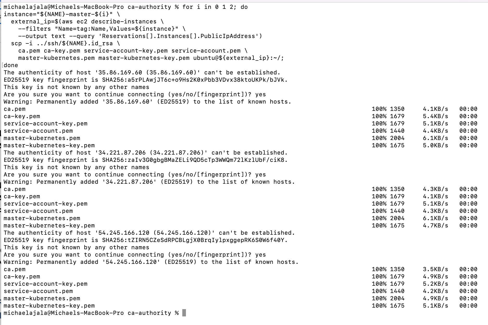

### STEP 5 USE `KUBECTL` TO GENERATE KUBERNETES CONFIGURATION FILES FOR AUTHENTICATION


Firstly, created a few environment variables for reuse by multiple commands.

```
KUBERNETES_API_SERVER_ADDRESS=$(aws elbv2 describe-load-balancers --load-balancer-arns ${LOAD_BALANCER_ARN} --output text --query 'LoadBalancers[].DNSName')
```


- Generate the kubelet kubeconfig file

The command below were run in the directory where all the certificates were generated

```
for i in 0 1 2; do

instance="${NAME}-worker-${i}"
instance_hostname="ip-172-31-0-2${i}"

 # Set the kubernetes cluster in the kubeconfig file
  kubectl config set-cluster ${NAME} \
    --certificate-authority=ca.pem \
    --embed-certs=true \
    --server=https://$KUBERNETES_API_SERVER_ADDRESS:6443 \
    --kubeconfig=${instance}.kubeconfig

# Set the cluster credentials in the kubeconfig file
  kubectl config set-credentials system:node:${instance_hostname} \
    --client-certificate=${instance}.pem \
    --client-key=${instance}-key.pem \
    --embed-certs=true \
    --kubeconfig=${instance}.kubeconfig

# Set the context in the kubeconfig file
  kubectl config set-context default \
    --cluster=${NAME} \
    --user=system:node:${instance_hostname} \
    --kubeconfig=${instance}.kubeconfig

  kubectl config use-context default --kubeconfig=${instance}.kubeconfig
done
```

- listed the output as seen below:

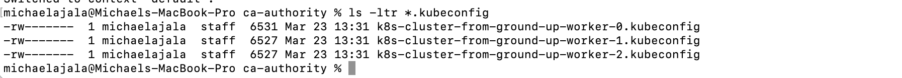


- Generate the kube-proxy kubeconfig

```
{
  kubectl config set-cluster ${NAME} \
    --certificate-authority=ca.pem \
    --embed-certs=true \
    --server=https://${KUBERNETES_API_SERVER_ADDRESS}:6443 \
    --kubeconfig=kube-proxy.kubeconfig

  kubectl config set-credentials system:kube-proxy \
    --client-certificate=kube-proxy.pem \
    --client-key=kube-proxy-key.pem \
    --embed-certs=true \
    --kubeconfig=kube-proxy.kubeconfig

  kubectl config set-context default \
    --cluster=${NAME} \
    --user=system:kube-proxy \
    --kubeconfig=kube-proxy.kubeconfig

  kubectl config use-context default --kubeconfig=kube-proxy.kubeconfig
}

```

- Generate the Kube-Controller-Manager kubeconfig

Notice that the --server is set to use 127.0.0.1. This is because, this component runs on the API-Server so there is no point routing through the Load Balancer.

```
{
  kubectl config set-cluster ${NAME} \
    --certificate-authority=ca.pem \
    --embed-certs=true \
    --server=https://127.0.0.1:6443 \
    --kubeconfig=kube-controller-manager.kubeconfig

  kubectl config set-credentials system:kube-controller-manager \
    --client-certificate=kube-controller-manager.pem \
    --client-key=kube-controller-manager-key.pem \
    --embed-certs=true \
    --kubeconfig=kube-controller-manager.kubeconfig

  kubectl config set-context default \
    --cluster=${NAME} \
    --user=system:kube-controller-manager \
    --kubeconfig=kube-controller-manager.kubeconfig

  kubectl config use-context default --kubeconfig=kube-controller-manager.kubeconfig
}
```

- Generating the Kube-Scheduler Kubeconfig


```
{
  kubectl config set-cluster ${NAME} \
    --certificate-authority=ca.pem \
    --embed-certs=true \
    --server=https://127.0.0.1:6443 \
    --kubeconfig=kube-scheduler.kubeconfig

  kubectl config set-credentials system:kube-scheduler \
    --client-certificate=kube-scheduler.pem \
    --client-key=kube-scheduler-key.pem \
    --embed-certs=true \
    --kubeconfig=kube-scheduler.kubeconfig

  kubectl config set-context default \
    --cluster=${NAME} \
    --user=system:kube-scheduler \
    --kubeconfig=kube-scheduler.kubeconfig

  kubectl config use-context default --kubeconfig=kube-scheduler.kubeconfig
}
```

- generate the kubeconfig file for the admin user

```
{
  kubectl config set-cluster ${NAME} \
    --certificate-authority=ca.pem \
    --embed-certs=true \
    --server=https://${KUBERNETES_API_SERVER_ADDRESS}:6443 \
    --kubeconfig=admin.kubeconfig

  kubectl config set-credentials admin \
    --client-certificate=admin.pem \
    --client-key=admin-key.pem \
    --embed-certs=true \
    --kubeconfig=admin.kubeconfig

  kubectl config set-context default \
    --cluster=${NAME} \
    --user=admin \
    --kubeconfig=admin.kubeconfig

  kubectl config use-context default --kubeconfig=admin.kubeconfig
} 
```


- Distributed the files to their respective servers, using scp and a for loop

for the WORKER NODES

  for worker 0
```
for i in 0; do
  instance="${NAME}-worker-${i}"
  external_ip=$(aws ec2 describe-instances \
    --filters "Name=tag:Name,Values=${instance}" \
    --output text --query 'Reservations[].Instances[].PublicIpAddress')
  scp -i ../ssh/${NAME}.id_rsa \
kube-proxy.kubeconfig k8s-cluster-from-ground-up-worker-{i}.kubeconfig ubuntu@${external_ip}:~/; \
done
```
  for worker 1

```
for i in 1; do
  instance="${NAME}-worker-${i}"
  external_ip=$(aws ec2 describe-instances \
    --filters "Name=tag:Name,Values=${instance}" \
    --output text --query 'Reservations[].Instances[].PublicIpAddress')
  scp -i ../ssh/${NAME}.id_rsa \
kube-proxy.kubeconfig k8s-cluster-from-ground-up-worker-${i}.kubeconfig ubuntu@${external_ip}:~/; \
done
```

  for worker 2

```
for i in 2; do
  instance="${NAME}-worker-${i}"
  external_ip=$(aws ec2 describe-instances \
    --filters "Name=tag:Name,Values=${instance}" \
    --output text --query 'Reservations[].Instances[].PublicIpAddress')
  scp -i ../ssh/${NAME}.id_rsa \
kube-proxy.kubeconfig k8s-cluster-from-ground-up-worker-${i}.kubeconfig ubuntu@${external_ip}:~/; \
done
``` 

for the MASTER NODE

```
for i in 0 1 2; do
  instance="${NAME}-master-${i}"
  external_ip=$(aws ec2 describe-instances \
    --filters "Name=tag:Name,Values=${instance}" \
    --output text --query 'Reservations[].Instances[].PublicIpAddress')
  scp -i ../ssh/${NAME}.id_rsa \
admin.kubeconfig kube-controller-manager.kubeconfig kube-scheduler.kubeconfig ubuntu@${external_ip}:~/; \
done
``` 

### STEP 6 PREPARE THE ETCD DATABASE FOR ENCRYPTION AT REST.

- Generated the encryption key and encoded it using base64

```
ETCD_ENCRYPTION_KEY=$(head -c 32 /dev/urandom | base64) 
```

```
echo $ETCD_ENCRYPTION_KEY
```

 the output can be seen below

 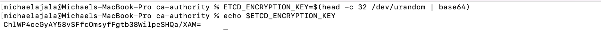

 - Created an encryption-config.yaml and populated it as seen below:

 ```
 cat > encryption-config.yaml <<EOF
kind: EncryptionConfig
apiVersion: v1
resources:
  - resources:
      - secrets
    providers:
      - aescbc:
          keys:
            - name: key1
              secret: ${ETCD_ENCRYPTION_KEY}
      - identity: {}
EOF
 ```

- sent the encryption file to the Controller nodes using scp and a for loop.


```
for i in 0 1 2; do
  instance="${NAME}-master-${i}"
  external_ip=$(aws ec2 describe-instances \
    --filters "Name=tag:Name,Values=${instance}" \
    --output text --query 'Reservations[].Instances[].PublicIpAddress')
  scp -i ../ssh/${NAME}.id_rsa \
encryption-config.yaml ubuntu@${external_ip}:~/; \
done
```

  - SSH into the controller server

  for Master 1

```
  master_1_ip=$(aws ec2 describe-instances \
--filters "Name=tag:Name,Values=${NAME}-master-0" \
--output text --query 'Reservations[].Instances[].PublicIpAddress')
ssh -i k8s-cluster-from-ground-up.id_rsa ubuntu@${master_1_ip}
```

for Master 2

```
master_2_ip=$(aws ec2 describe-instances \
--filters "Name=tag:Name,Values=${NAME}-master-1" \
--output text --query 'Reservations[].Instances[].PublicIpAddress')
ssh -i k8s-cluster-from-ground-up.id_rsa ubuntu@${master_2_ip}
```

for Master 3

```
master_3_ip=$(aws ec2 describe-instances \
--filters "Name=tag:Name,Values=${NAME}-master-2" \
--output text --query 'Reservations[].Instances[].PublicIpAddress')
ssh -i k8s-cluster-from-ground-up.id_rsa ubuntu@${master_3_ip}
```

After a successful ssh into the servers listed the files that have been sent to the nodes, as seen below.

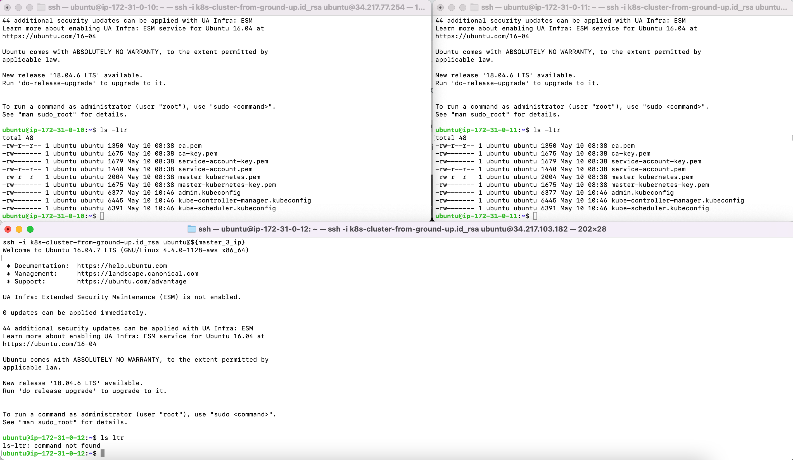

- Downloaded and installed etcd

```
  wget -q --show-progress --https-only --timestamping \
  "https://github.com/etcd-io/etcd/releases/download/v3.4.15/etcd-v3.4.15-linux-amd64.tar.gz"
```

- Extracted and installed the etcd server and the etcdctl command line utility

```
{
tar -xvf etcd-v3.4.15-linux-amd64.tar.gz
sudo mv etcd-v3.4.15-linux-amd64/etcd* /usr/local/bin/
}
```

- Configure the etcd server

```
{
  sudo mkdir -p /etc/etcd /var/lib/etcd
  sudo chmod 700 /var/lib/etcd
  sudo cp ca.pem master-kubernetes-key.pem master-kubernetes.pem /etc/etcd/
}
```

- The instance internal IP address will be used to serve client requests and communicate with etcd cluster peers. Retrieved the internal IP address for the current compute instance:

```
export INTERNAL_IP=$(curl -s http://169.254.169.254/latest/meta-data/local-ipv4)
```

- Each etcd member must have a unique name within an etcd cluster. Set the etcd name to node Private IP address so it will uniquely identify the machine:

```
ETCD_NAME=$(curl -s http://169.254.169.254/latest/user-data/ \
  | tr "|" "\n" | grep "^name" | cut -d"=" -f2)

echo ${ETCD_NAME}
```

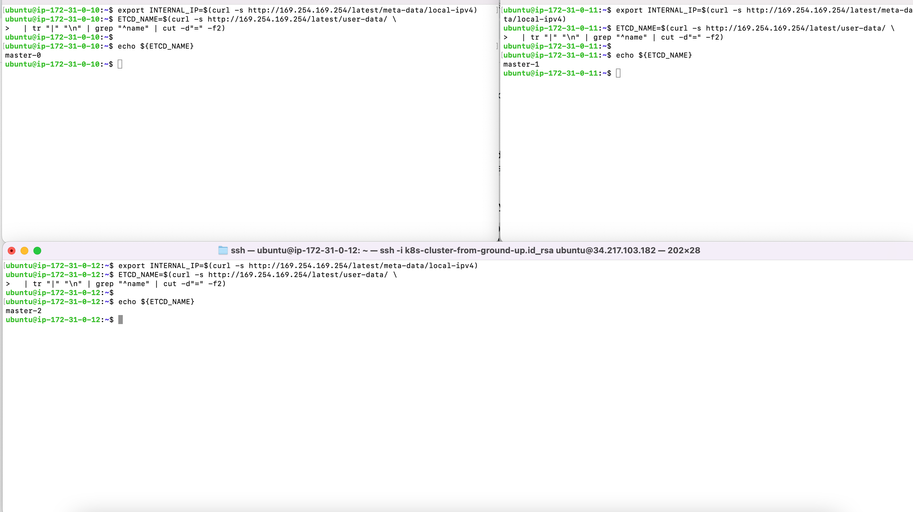

- Created the etcd.service systemd unit file:

```
cat <<EOF | sudo tee /etc/systemd/system/etcd.service
[Unit]
Description=etcd
Documentation=https://github.com/coreos

[Service]
Type=notify
ExecStart=/usr/local/bin/etcd \\
  --name ${ETCD_NAME} \\
  --trusted-ca-file=/etc/etcd/ca.pem \\
  --peer-trusted-ca-file=/etc/etcd/ca.pem \\
  --peer-client-cert-auth \\
  --client-cert-auth \\
  --listen-peer-urls https://${INTERNAL_IP}:2380 \\
  --listen-client-urls https://${INTERNAL_IP}:2379,https://127.0.0.1:2379 \\
  --advertise-client-urls https://${INTERNAL_IP}:2379 \\
  --initial-cluster-token etcd-cluster-0 \\
  --initial-cluster master-0=https://172.31.0.10:2380,master-1=https://172.31.0.11:2380,master-2=https://172.31.0.12:2380 \\
  --cert-file=/etc/etcd/master-kubernetes.pem \\
  --key-file=/etc/etcd/master-kubernetes-key.pem \\
  --peer-cert-file=/etc/etcd/master-kubernetes.pem \\
  --peer-key-file=/etc/etcd/master-kubernetes-key.pem \\
  --initial-advertise-peer-urls https://${INTERNAL_IP}:2380 \\
  --initial-cluster-state new \\
  --data-dir=/var/lib/etcd
Restart=on-failure
RestartSec=5

[Install]
WantedBy=multi-user.target
EOF
```

- Started and enabled the etcd Server

```
{
sudo systemctl daemon-reload
sudo systemctl enable etcd
sudo systemctl start etcd
}
```

- Verified the etcd installation

```

```

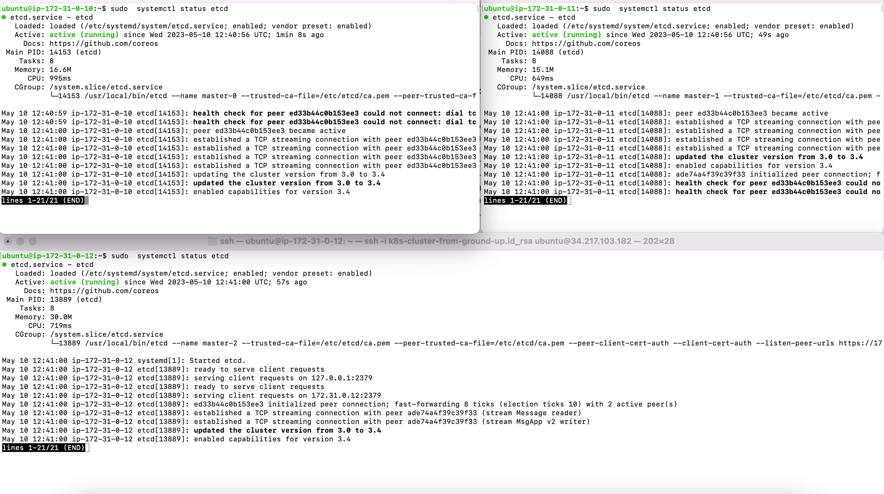

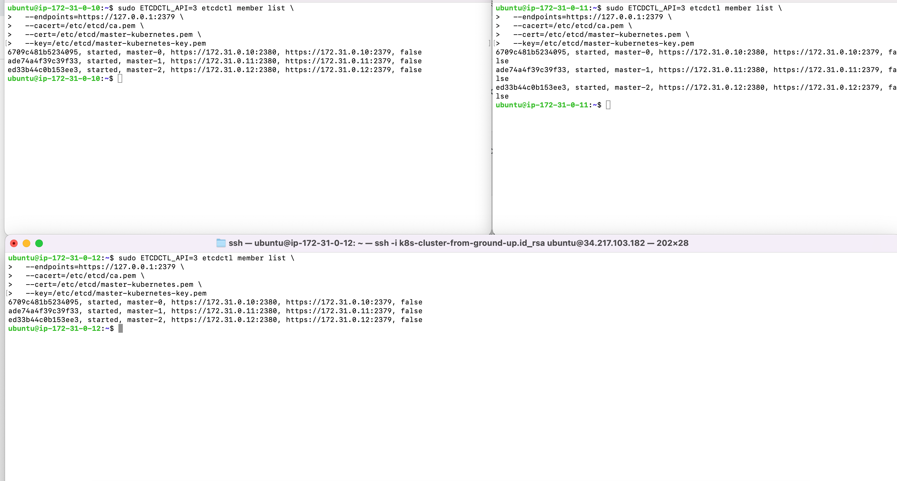

### BOOTSTRAP THE CONTROL PLANE

- Created the Kubernetes configuration directory:
```
sudo mkdir -p /etc/kubernetes/config
```

- Download the official Kubernetes release binaries:
```
wget -q --show-progress --https-only --timestamping \
"https://storage.googleapis.com/kubernetes-release/release/v1.21.0/bin/linux/amd64/kube-apiserver" \
"https://storage.googleapis.com/kubernetes-release/release/v1.21.0/bin/linux/amd64/kube-controller-manager" \
"https://storage.googleapis.com/kubernetes-release/release/v1.21.0/bin/linux/amd64/kube-scheduler" \
"https://storage.googleapis.com/kubernetes-release/release/v1.21.0/bin/linux/amd64/kubectl"
```

-nInstalled the Kubernetes binaries:
```
{
chmod +x kube-apiserver kube-controller-manager kube-scheduler kubectl
sudo mv kube-apiserver kube-controller-manager kube-scheduler kubectl /usr/local/bin/
}
```

- Configures the Kubernetes API Server:
```
{
sudo mkdir -p /var/lib/kubernetes/

sudo mv ca.pem ca-key.pem master-kubernetes-key.pem master-kubernetes.pem \
service-account-key.pem service-account.pem \
encryption-config.yaml /var/lib/kubernetes/
}
```

- The instance internal IP address will be used to advertise the API Server to members of the cluster. Retrieve the internal IP address for the current compute instance:

```
export INTERNAL_IP=$(curl -s http://169.254.169.254/latest/meta-data/local-ipv4)
```

- Created the kube-apiserver.service systemd unit file:

```
cat <<EOF | sudo tee /etc/systemd/system/kube-apiserver.service
[Unit]
Description=Kubernetes API Server
Documentation=https://github.com/kubernetes/kubernetes

[Service]
ExecStart=/usr/local/bin/kube-apiserver \\
  --advertise-address=${INTERNAL_IP} \\
  --allow-privileged=true \\
  --apiserver-count=3 \\
  --audit-log-maxage=30 \\
  --audit-log-maxbackup=3 \\
  --audit-log-maxsize=100 \\
  --audit-log-path=/var/log/audit.log \\
  --authorization-mode=Node,RBAC \\
  --bind-address=0.0.0.0 \\
  --client-ca-file=/var/lib/kubernetes/ca.pem \\
  --enable-admission-plugins=NamespaceLifecycle,NodeRestriction,LimitRanger,ServiceAccount,DefaultStorageClass,ResourceQuota \\
  --etcd-cafile=/var/lib/kubernetes/ca.pem \\
  --etcd-certfile=/var/lib/kubernetes/master-kubernetes.pem \\
  --etcd-keyfile=/var/lib/kubernetes/master-kubernetes-key.pem\\
  --etcd-servers=https://172.31.0.10:2379,https://172.31.0.11:2379,https://172.31.0.12:2379 \\
  --event-ttl=1h \\
  --encryption-provider-config=/var/lib/kubernetes/encryption-config.yaml \\
  --kubelet-certificate-authority=/var/lib/kubernetes/ca.pem \\
  --kubelet-client-certificate=/var/lib/kubernetes/master-kubernetes.pem \\
  --kubelet-client-key=/var/lib/kubernetes/master-kubernetes-key.pem \\
  --runtime-config='api/all=true' \\
  --service-account-key-file=/var/lib/kubernetes/service-account.pem \\
  --service-account-signing-key-file=/var/lib/kubernetes/service-account-key.pem \\
  --service-account-issuer=https://${INTERNAL_IP}:6443 \\
  --service-cluster-ip-range=172.32.0.0/24 \\
  --service-node-port-range=30000-32767 \\
  --tls-cert-file=/var/lib/kubernetes/master-kubernetes.pem \\
  --tls-private-key-file=/var/lib/kubernetes/master-kubernetes-key.pem \\
  --v=2
Restart=on-failure
RestartSec=5

[Install]
WantedBy=multi-user.target
EOF
```

Configured the Kubernetes Controller Manager:

- Moved the kube-controller-manager kubeconfig into place:

```
sudo mv kube-controller-manager.kubeconfig /var/lib/kubernetes/
```

- Export some variables to retrieve the vpc_cidr – This will be required for the bind-address flag:

```
export AWS_METADATA="http://169.254.169.254/latest/meta-data"
export EC2_MAC_ADDRESS=$(curl -s $AWS_METADATA/network/interfaces/macs/ | head -n1 | tr -d '/')
export VPC_CIDR=$(curl -s $AWS_METADATA/network/interfaces/macs/$EC2_MAC_ADDRESS/vpc-ipv4-cidr-block/)
export NAME=k8s-cluster-from-ground-up
```

- Created the kube-controller-manager.service systemd unit file:

```
cat <<EOF | sudo tee /etc/systemd/system/kube-controller-manager.service
[Unit]
Description=Kubernetes Controller Manager
Documentation=https://github.com/kubernetes/kubernetes

[Service]
ExecStart=/usr/local/bin/kube-controller-manager \\
  --bind-address=0.0.0.0 \\
  --cluster-cidr=${VPC_CIDR} \\
  --cluster-name=${NAME} \\
  --cluster-signing-cert-file=/var/lib/kubernetes/ca.pem \\
  --cluster-signing-key-file=/var/lib/kubernetes/ca-key.pem \\
  --kubeconfig=/var/lib/kubernetes/kube-controller-manager.kubeconfig \\
  --authentication-kubeconfig=/var/lib/kubernetes/kube-controller-manager.kubeconfig \\
  --authorization-kubeconfig=/var/lib/kubernetes/kube-controller-manager.kubeconfig \\
  --leader-elect=true \\
  --root-ca-file=/var/lib/kubernetes/ca.pem \\
  --service-account-private-key-file=/var/lib/kubernetes/service-account-key.pem \\
  --service-cluster-ip-range=172.32.0.0/24 \\
  --use-service-account-credentials=true \\
  --v=2
Restart=on-failure
RestartSec=5

[Install]
WantedBy=multi-user.target
EOF
```

Configured the Kubernetes Scheduler:

- Moved the kube-scheduler kubeconfig into place:

```
sudo mv kube-scheduler.kubeconfig /var/lib/kubernetes/
sudo mkdir -p /etc/kubernetes/config
```

- Created the kube-scheduler.yaml configuration file:

```
cat <<EOF | sudo tee /etc/kubernetes/config/kube-scheduler.yaml
apiVersion: kubescheduler.config.k8s.io/v1beta1
kind: KubeSchedulerConfiguration
clientConnection:
  kubeconfig: "/var/lib/kubernetes/kube-scheduler.kubeconfig"
leaderElection:
  leaderElect: true
EOF
```

- Created the kube-scheduler.service systemd unit file:

```
cat <<EOF | sudo tee /etc/systemd/system/kube-scheduler.service
[Unit]
Description=Kubernetes Scheduler
Documentation=https://github.com/kubernetes/kubernetes

[Service]
ExecStart=/usr/local/bin/kube-scheduler \\
  --config=/etc/kubernetes/config/kube-scheduler.yaml \\
  --v=2
Restart=on-failure
RestartSec=5

[Install]
WantedBy=multi-user.target
EOF
```

 Start the Controller Services

 ```
 {
sudo systemctl daemon-reload
sudo systemctl enable kube-apiserver kube-controller-manager kube-scheduler
sudo systemctl start kube-apiserver kube-controller-manager kube-scheduler
}
 ```

Check the status of the services.

```
{
sudo systemctl status kube-apiserver
sudo systemctl status kube-controller-manager
sudo systemctl status kube-scheduler
}
```
all the three services are active, as seen below.

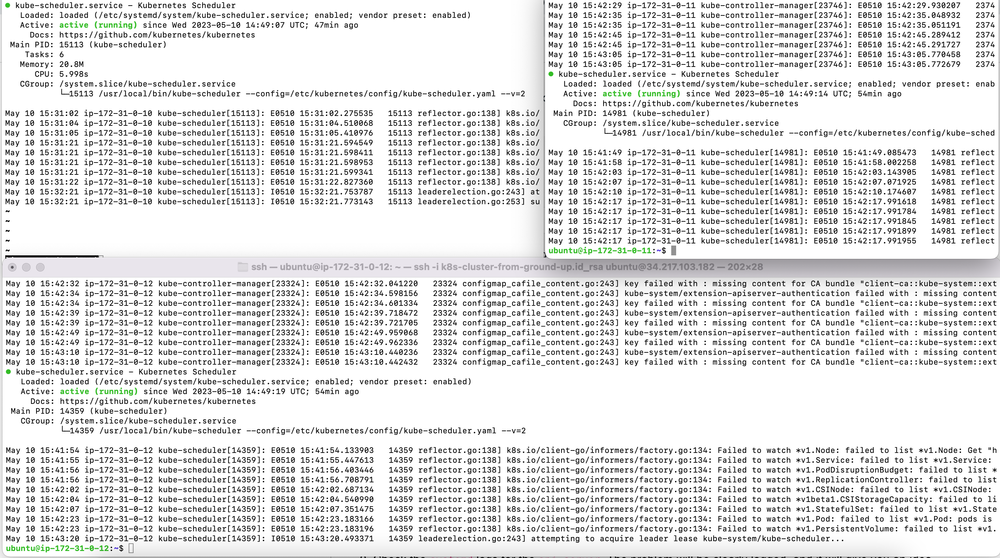

TESTED THE CONTROLLER NODE TO ENSURE THAT EVERYTHING IS WORKING FINE

- Accessed the cluster 

```
kubectl cluster-info  --kubeconfig admin.kubeconfig
```

- To get the current namespaces:

```
kubectl get namespaces --kubeconfig admin.kubeconfig
```

- To reach the Kubernetes API Server publicly

```
curl --cacert /var/lib/kubernetes/ca.pem https://$INTERNAL_IP:6443/version
```

- To get the status of each component:

```
kubectl get componentstatuses --kubeconfig admin.kubeconfig
```

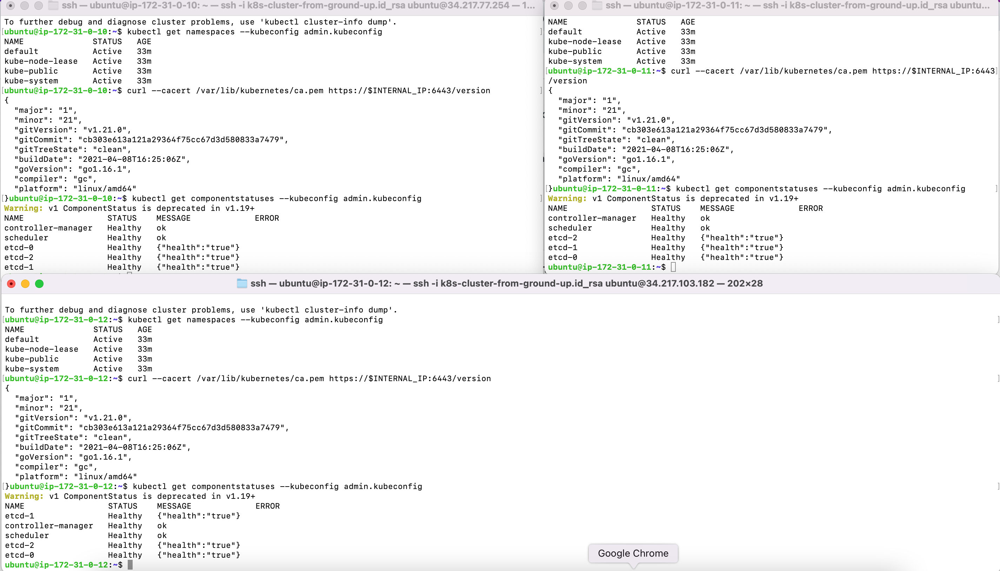


On one of the controller nodes, configured Role Based Access Control (RBAC) so that the api-server has necessary authorization for for the kubelet.

- Create the ClusterRole:


```
cat <<EOF | kubectl apply --kubeconfig admin.kubeconfig -f -
apiVersion: rbac.authorization.k8s.io/v1
kind: ClusterRole
metadata:
  annotations:
    rbac.authorization.kubernetes.io/autoupdate: "true"
  labels:
    kubernetes.io/bootstrapping: rbac-defaults
  name: system:kube-apiserver-to-kubelet
rules:
  - apiGroups:
      - ""
    resources:
      - nodes/proxy
      - nodes/stats
      - nodes/log
      - nodes/spec
      - nodes/metrics
    verbs:
      - "*"
EOF
```

- Created the ClusterRoleBinding to bind the kubernetes user with the role created above:

```
cat <<EOF | kubectl --kubeconfig admin.kubeconfig  apply -f -
apiVersion: rbac.authorization.k8s.io/v1
kind: ClusterRoleBinding
metadata:
  name: system:kube-apiserver
  namespace: ""
roleRef:
  apiGroup: rbac.authorization.k8s.io
  kind: ClusterRole
  name: system:kube-apiserver-to-kubelet
subjects:
  - apiGroup: rbac.authorization.k8s.io
    kind: User
    name: kubernetes
EOF
```

Configured RBAC permissions to allow the Kubernetes API Server to access the Kubelet API on each worker node. Access to the Kubelet API is required for retrieving metrics, logs, and executing commands in pods.

- Created the system:kube-apiserver-to-kubelet ClusterRole with permissions to access the Kubelet API and perform most common tasks associated with managing pods on the worker nodes:

- Ran the script below  on the Controller node:

```
cat <<EOF | kubectl apply --kubeconfig admin.kubeconfig -f -
apiVersion: rbac.authorization.k8s.io/v1
kind: ClusterRole
metadata:
  annotations:
    rbac.authorization.kubernetes.io/autoupdate: "true"
  labels:
    kubernetes.io/bootstrapping: rbac-defaults
  name: system:kube-apiserver-to-kubelet
rules:
  - apiGroups:
      - ""
    resources:
      - nodes/proxy
      - nodes/stats
      - nodes/log
      - nodes/spec
      - nodes/metrics
    verbs:
      - "*"
EOF
```

Binded the system:kube-apiserver-to-kubelet ClusterRole to the kubernetes user so that API server can authenticate successfully to the kubelets on the worker nodes:

```
cat <<EOF | kubectl apply --kubeconfig admin.kubeconfig -f -
apiVersion: rbac.authorization.k8s.io/v1
kind: ClusterRoleBinding
metadata:
  name: system:kube-apiserver
  namespace: ""
roleRef:
  apiGroup: rbac.authorization.k8s.io
  kind: ClusterRole
  name: system:kube-apiserver-to-kubelet
subjects:
  - apiGroup: rbac.authorization.k8s.io
    kind: User
    name: kubernetes
EOF
```

### Bootstraping components on the worker nodes


The following components were installed on each node:

kubelet
kube-proxy
Containerd or Docker
Networking plugins

SSH into the worker nodes

- Worker-1
```
worker_1_ip=$(aws ec2 describe-instances \
--filters "Name=tag:Name,Values=${NAME}-worker-0" \
--output text --query 'Reservations[].Instances[].PublicIpAddress')
ssh -i k8s-cluster-from-ground-up.id_rsa ubuntu@${worker_1_ip}
```

- Worker-2
```
worker_2_ip=$(aws ec2 describe-instances \
--filters "Name=tag:Name,Values=${NAME}-worker-1" \
--output text --query 'Reservations[].Instances[].PublicIpAddress')
ssh -i k8s-cluster-from-ground-up.id_rsa ubuntu@${worker_2_ip}
```

- Worker-3
```
worker_3_ip=$(aws ec2 describe-instances \
--filters "Name=tag:Name,Values=${NAME}-worker-2" \
--output text --query 'Reservations[].Instances[].PublicIpAddress')
ssh -i k8s-cluster-from-ground-up.id_rsa ubuntu@${worker_3_ip}
```

Checked if swap is enabled on the host. If swap is not disabled, kubelet will not start. It is highly recommended to allow Kubernetes to handle resource allocation.

```
sudo swapon --show
```

there was no output which means it is not enabled.

Downloaded and installed a container runtime. (Containerd)

- Downloaded binaries for runc, cri-ctl, and containerd

```
 wget https://github.com/opencontainers/runc/releases/download/v1.0.0-rc93/runc.amd64 \
  https://github.com/kubernetes-sigs/cri-tools/releases/download/v1.21.0/crictl-v1.21.0-linux-amd64.tar.gz \
  https://github.com/containerd/containerd/releases/download/v1.4.4/containerd-1.4.4-linux-amd64.tar.gz 
```

- Configure containerd:

```
{
  mkdir containerd
  tar -xvf crictl-v1.21.0-linux-amd64.tar.gz
  tar -xvf containerd-1.4.4-linux-amd64.tar.gz -C containerd
  sudo mv runc.amd64 runc
  chmod +x  crictl runc  
  sudo mv crictl runc /usr/local/bin/
  sudo mv containerd/bin/* /bin/
}
```

```
sudo mkdir -p /etc/containerd/
```

```
cat << EOF | sudo tee /etc/containerd/config.toml
[plugins]
  [plugins.cri.containerd]
    snapshotter = "overlayfs"
    [plugins.cri.containerd.default_runtime]
      runtime_type = "io.containerd.runtime.v1.linux"
      runtime_engine = "/usr/local/bin/runc"
      runtime_root = ""
EOF
```

Created the containerd.service systemd unit file:

```
cat <<EOF | sudo tee /etc/systemd/system/containerd.service
[Unit]
Description=containerd container runtime
Documentation=https://containerd.io
After=network.target

[Service]
ExecStartPre=/sbin/modprobe overlay
ExecStart=/bin/containerd
Restart=always
RestartSec=5
Delegate=yes
KillMode=process
OOMScoreAdjust=-999
LimitNOFILE=1048576
LimitNPROC=infinity
LimitCORE=infinity

[Install]
WantedBy=multi-user.target
EOF
```

Created directories to configure kubelet, kube-proxy, cni, and a directory to keep the kubernetes root ca file:

```
sudo mkdir -p \
  /var/lib/kubelet \
  /var/lib/kube-proxy \
  /etc/cni/net.d \
  /opt/cni/bin \
  /var/lib/kubernetes \
  /var/run/kubernetes
```

- Download and Install CNI

Kubernetes uses CNI as an interface between network providers and Kubernetes Pod networking. Network providers create network plugin that can be used to implement the Kubernetes networking, and includes additional set of rich features that Kubernetes does not provide out of the box.

downloaded the available plugins

```
wget -q --show-progress --https-only --timestamping \
  https://github.com/containernetworking/plugins/releases/download/v0.9.1/cni-plugins-linux-amd64-v0.9.1.t
```

- Installed CNI into /opt/cni/bin/

```
sudo tar -xvf cni-plugins-linux-amd64-v0.9.1.tgz -C /opt/cni/bin/
```

The output showed the plugins that comes with the CNI.

- Downloaded binaries for kubectl, kube-proxy, and kubelet

```
wget -q --show-progress --https-only --timestamping \
  https://storage.googleapis.com/kubernetes-release/release/v1.21.0/bin/linux/amd64/kubectl \
  https://storage.googleapis.com/kubernetes-release/release/v1.21.0/bin/linux/amd64/kube-proxy \
  https://storage.googleapis.com/kubernetes-release/release/v1.21.0/bin/linux/amd64/kubelet

```

- Installed the Downloaded binaries 

```
{
  chmod +x  kubectl kube-proxy kubelet  
  sudo mv  kubectl kube-proxy kubelet /usr/local/bin/
}
```

CONFIGURED THE WORKER NODES COMPONENTS

- to Configure kubelet:

Configuring the network

Get the POD_CIDR that will be used as part of network configuration
```
POD_CIDR=$(curl -s http://169.254.169.254/latest/user-data/ \
  | tr "|" "\n" | grep "^pod-cidr" | cut -d"=" -f2)
echo "${POD_CIDR}"
```

- Configure the bridge and loopback networks

Bridge:

```
cat > 172-20-bridge.conf <<EOF
{
    "cniVersion": "0.3.1",
    "name": "bridge",
    "type": "bridge",
    "bridge": "cnio0",
    "isGateway": true,
    "ipMasq": true,
    "ipam": {
        "type": "host-local",
        "ranges": [
          [{"subnet": "${POD_CIDR}"}]
        ],
        "routes": [{"dst": "0.0.0.0/0"}]
    }
}
EOF
```

Loopback:
```
cat > 99-loopback.conf <<EOF
{
    "cniVersion": "0.3.1",
    "type": "loopback"
}
EOF
```

- Moved the files to the network configuration directory:
```
sudo mv 172-20-bridge.conf 99-loopback.conf /etc/cni/net.d/
```

- Stored the worker’s name in a variable:
```
NAME=k8s-cluster-from-ground-up
WORKER_NAME=${NAME}-$(curl -s http://169.254.169.254/latest/user-data/ \
  | tr "|" "\n" | grep "^name" | cut -d"=" -f2)
echo "${WORKER_NAME}"
```

- Moved the certificates and kubeconfig file to their respective configuration directories:
```
sudo mv ${WORKER_NAME}-key.pem ${WORKER_NAME}.pem /var/lib/kubelet/
sudo mv ${WORKER_NAME}.kubeconfig /var/lib/kubelet/kubeconfig
sudo mv kube-proxy.kubeconfig /var/lib/kube-proxy/kubeconfig
sudo mv ca.pem /var/lib/kubernetes/
```

- Created the kubelet-config.yaml file

```
cat <<EOF | sudo tee /var/lib/kubelet/kubelet-config.yaml
kind: KubeletConfiguration
apiVersion: kubelet.config.k8s.io/v1beta1
authentication:
  anonymous:
    enabled: false
  webhook:
    enabled: true
  x509:
    clientCAFile: "/var/lib/kubernetes/ca.pem"
authorization:
  mode: Webhook
clusterDomain: "cluster.local"
clusterDNS:
  - "10.32.0.10"
resolvConf: "/etc/resolv.conf"
runtimeRequestTimeout: "15m"
tlsCertFile: "/var/lib/kubelet/${WORKER_NAME}.pem"
tlsPrivateKeyFile: "/var/lib/kubelet/${WORKER_NAME}-key.pem"
EOF
```

- Configured the kubelet systemd service

```
cat <<EOF | sudo tee /etc/systemd/system/kubelet.service
[Unit]
Description=Kubernetes Kubelet
Documentation=https://github.com/kubernetes/kubernetes
After=containerd.service
Requires=containerd.service
[Service]
ExecStart=/usr/local/bin/kubelet \\
  --config=/var/lib/kubelet/kubelet-config.yaml \\
  --cluster-domain=cluster.local \\
  --container-runtime=remote \\
  --container-runtime-endpoint=unix:///var/run/containerd/containerd.sock \\
  --image-pull-progress-deadline=2m \\
  --kubeconfig=/var/lib/kubelet/kubeconfig \\
  --network-plugin=cni \\
  --register-node=true \\
  --v=2
Restart=on-failure
RestartSec=5
[Install]
WantedBy=multi-user.target
EOF
```

- Create the kube-proxy.yaml file
```
cat <<EOF | sudo tee /var/lib/kube-proxy/kube-proxy-config.yaml
kind: KubeProxyConfiguration
apiVersion: kubeproxy.config.k8s.io/v1alpha1
clientConnection:
  kubeconfig: "/var/lib/kube-proxy/kubeconfig"
mode: "iptables"
clusterCIDR: "172.31.0.0/16"
EOF
```

- Configure the Kube Proxy systemd service
```
cat <<EOF | sudo tee /etc/systemd/system/kube-proxy.service
[Unit]
Description=Kubernetes Kube Proxy
Documentation=https://github.com/kubernetes/kubernetes
[Service]
ExecStart=/usr/local/bin/kube-proxy \\
  --config=/var/lib/kube-proxy/kube-proxy-config.yaml
Restart=on-failure
RestartSec=5
[Install]
WantedBy=multi-user.target
EOF
```

- Reload configurations and start both services

{
  sudo systemctl daemon-reload
  sudo systemctl enable containerd kubelet kube-proxy
  sudo systemctl start containerd kubelet kube-proxy
}


AS SEEN BELOW THE WORKER NODE US JOINED TO THE CLUSTER, AND IT IS IN A READY STATE.

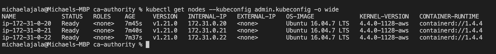